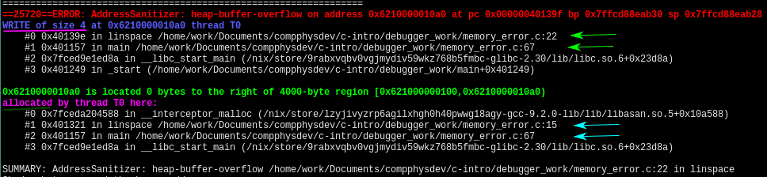

---
header-includes:
- \usepackage[a4paper, total={6in, 9in}]{geometry}
- \usepackage{fancyhdr}
- \pagestyle{fancy}
- \fancyhead[L]{FKA121/FIM540 Computational physics}
- \fancyhead[R]{C3b Debugging tools}
colorlinks: true
output: pdf_document
---
Exercise C3b: Debugging tools
====

## Terminology

In this document a couple of computer science terms are used.
Here is a brief glossary:

  * *Stack trace*; this will give you information about where the program crashed
    and what path it took. By path, we mean which function caused the crash,
    which function called that function, and which funciton called *that*
    function, etc., all the way up to the main function of your program.
  * The *heap* is the memory region that can be requested during run time from the OS
    (e.g. `malloc` and `calloc` grabs heap memory)
  * The *stack* is the memory that can be assigned during the compilation of
    your program and is requested at the start of your program (e.g. `float data[100]`).
  * A *breakpoint* is a point in your program where the execution should be
    stopped for further investigation, i.e. printing variables and single steps
    to see how a varible is changing during the exection, for example.
  * A *memory leak* is when your program has requested memory via malloc or calloc
    and has lost the reference to the memory region without freeing the memory.
    The program below shows a small snippet of a memory leak.

```c

#include <stdlib.h> // calloc

// Useless program containing a memory leak.
int main(){
    // Allocate array on the heap
    float *data = calloc(10, sizeof(float));
    // Allocate array on the stack
    float data_1[10] = {0};

    // Memory leak: losing refernce
    // to the allocated memory from calloc
    data = &data_1[0];

    // Can not free stack arrays
    // since this line is effectivley:
    // free(data_1); data_1 = NULL;
    free(data); data = NULL;
    return 0;
}
```

# Background

## Debbuging your code

Debugging your code can be hard in C, as the compiler provides minimal
debugging tools, except for compilation errors and warnings.
If you are not careful it is
easy to corrupt your program's memory or try to access memory the program is not
allowed to access.
In the latter case your program will crash with the message
`Segmentation fault (core dumped)`.

Nevertheless, there are a wide variety of tools developed with the purpose to
help you as a programmer to find errors and optimise your code, such tools are for
example `gcov`, memory sanitizer, address sanitizer, leak sanitizer,
`valgrind`, `gdb`, `orbit` etc.
The list is long, so if you are curious you have to do your own research.
We will touch on the tools we find necessary and have some experience with,
namely `gdb` and address sanitizer. Address sanitizer is mainly
used to find run time errors such as stack overflows, heap overflows and memory
leaks etc. `gdb` (GNU debugger) is a stepping tool where you can set
breakpoints and print variables in your code during run time, among other
things.


## Address sanitizer
To use address sanitizer you need to add a couple of flags to your program

  * -g (includes information about the human-readable function name, the name
    of the file they are defined in and the line number. This is used to get a
    proper stack trace)
  * -fsanitize=address (enable address sanitizer)
  * -fno-omit-frame-pointer (this is to get nicer stack traces from  address
    sanitizer)

In depth documentations for the address sanitizer is found
[here](https://github.com/google/sanitizers/wiki/AddressSanitizer).

We will briefly show the most common once in the examples below
```c

#include <stdlib.h> // malloc

int *use_after_scope(){
    int atoms[10] = {0};
    return &atoms[0];
}

int main(){
    int atoms[10] = {0};

    // Stack buffer overflow
    // Notice that atoms max indexing
    // is atoms[9], however we index atoms[14]
    for(int i = 0; i < 15; i++){
        atoms[i] = i;
    }

    // Heap buffer overflows is the
    // the same as above but with the
    // array allocated as follows
    int *atoms = malloc(sizeof(int)*10);

    for(int i = 0; i < 15; i++){
        atoms[i] = i;
    }

    // Use after scope is also found address sanitizer.
    // This is when you use a stack array outside its scope.
    // Run the program as:
    // ASAN_OPTIONS=detect_stack_use_after_scope=1 ./program
    int *atoms = use_after_scope()
    // atoms contains junk here since
    // stack arrays explicitly lives inside
    // its scope (this time the function use_after_return)
    // not to be confused with dynamically allocated arrays.
    printf("%i\n", atoms[0]);

    return 0;
}
```


It should be noted that address sanitizer slows down the program significantly
so we advise you to test your code with a smaller data set before doing a
\"production run\". Below is the stack trace provided by address
sanitizer.

The output shows that address sanitizer found a heap buffer overflow.
This means that we tried to write outside a dynamically allocated array
(see pink underscore).
The path taken to crash was from line 67 in file memory\_error.c and the crash
happened on line 22 in file memory\_error.c (see green arrows).
The other parts of the stack trace are from libc generated functions
(ignore those as they are not important).
Furthermore it tells you that the array was allocated at line 15 in file
memory\_error.c where the function was called from line 67 in file
memory\_error.c (see teal arrows).



## Useful CFLAGS
Additionally to the previous mentioned CFLAGS there is a couple of more that is
good practice to always use, e.g.

  * -Werror (make all warnings into errors)
  * -Wall (the complier tracks more potential errors)
  * -pedantic (Warn about all code that does not follow ISO C)
  * -O2 (This telling the compiler that it should optimize your code)

Sometimes these flags can help you, e.g., catch errors related to the use of
uninitalized memory, or just be a pure speed up.

## gdb
First of, we think it is a good idea to modify the gdb user interface slightly,
we do this by a modified version of
[gdb-dashboard](https://github.com/cyrus-and/gdb-dashboard).
Install the modification by moving the file `gdbinit` from this folder to `~/.gdbinit`.
Basic usage of gdb is as follows:

  * Start gdb by running `gdb /path/to/executable`
  * Type `break [filename:linenumber]` or `break [function]` (set a breakpoint in the
    code)
  * Type `r` to run the code until the first breakpoint is reached.
  * To add break points inside, e.g., for loops you can type `break if i == 50`.
    This will pause the code when i = 50.
  * `n [x]` step (x) instructions.
  * `c [x]` continue (x) breakpoints.
  * `p [varible name]`  or `p [array name[index]]` (`p [array name]` would give you the
    address to the array)
  * `s` step into the function that you are currently about to execute.
  * `info break` (prints a list of break points)
  * `disable [x]` will disable the x'th breakpoint
  * `enable [x]` will re-enable the x'th breakpoint.

There is a lot more to `gdb` however this is enough to get you started (and we
think it is plenty for the work in this course).

It is probably a good idea to compile with -O0 instead of -O2 when using `gdb`.
This is because, with -O2 the compiler will very likely remove variables that
are superfluous, however, these variables might still be useful when debugging.
However, with -O0 the compiler will make no such optimizations and the variables
will thus be available when you need to check their value.

# Task

The file `fix_me.c` contains a few bugs that you will need to find by utilising
address sanitizer and gdb. Even though you can find the errors without the
tools please use them as it will help you to understand the tools when more
complex code is involved (i.e. when you are writing code for your homework H1, H2 and H3).

To run the program with address sanitizer/memory sanitizer compile the program as

```
make address && ./address
```
This will include a couple of extra flags that should be visible after you typed make.
To run for gdb compile with

```
make gdb
gdb ./program_gdb
```

