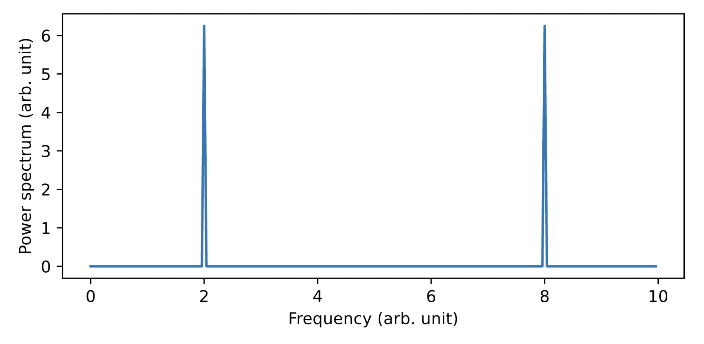

---
header-includes:
- \usepackage[a4paper, total={6in, 9in}]{geometry}
- \usepackage{fancyhdr}
- \pagestyle{fancy}
- \fancyhead[L]{FKA121/FIM540 Computational physics}
- \fancyhead[R]{C4 Fourier transformation}
colorlinks: true
output: pdf_document
---
# Exercise C4b: Fourier transformation

It is very useful to illustrate vibrational motion in Fourier space, which is used in, e.g., E1 and H1.
The transformation is done using the discrete Fourier transform.
Some basic properties of the discrete Fourier transform can be found in Lecture notes "Molecular dynamics", appendix F. 

To get used to the discrete Fourier transform we will consider a few simple cases.
Consider the time-dependent signal

$$ h(t) = a \cos{(2 \pi f t + \phi)} $$

For this task it is ok to use python.

 - generate the signal $h(t)$ using $a=1, \phi=0, f=2, \Delta t = 0.1$ and $N=250.$ Plot your result. Switch to $f=1$, run the program and plot the new result for $h(t)$. Switch to $\phi=\pi/2$ and $f=2$ and plot the result for $h(t)$. Which function do you obtain?

 - Consider next the Fourier transform of $h(t)$. Use numpy to determine the discrete Fourier transform of $h(t)$ using $a$=1, $\Phi$=0, $f$=2, $\Delta t$=0.1, and $N$=250 and plot the corresponding asymmetric power spectrum $P_n$ for $n=0,1,\ldots,(N-1)$. Run the program and plot the result for $P_n$. The result should look like figure \ref{asym}. Do you understand the spectrum?

- It is more convenient to plot the symmetric power spectrum, i.e. $P_n$ for $n=N/2,\dots,(N-1),0,\ldots,(N/2-1)$. Why?
  Perform the appropriate shift to obtain exactly the spectrum of figure \ref{sym}.
  Run the program and plot the result for $P_n$.
  Do you understand the frequency scale on the x-axis? What are the minimum and
  maximum frequencies? Change to $N=253$ and $N=255$, respectively, and plot in both
  cases $h(t)$ and $P_n$. Can you comment on your results?

- Consider now the signal
  $$ h(t) = a_1 \cos{(2 \pi f_1 t + \Phi_1)} + a_2 \cos{(2 \pi f_2 t + \Phi_2)} $$
  with $a_1 = a_2 = 1$, $\Phi_1 = \Phi_2 = 0$, $f_1 = 2$, $f_2 = 6$, and $\Delta t = 0.1$, $N=250$.
  What is the Nyqvist frequency in this case?
  Fourier transform $h(t)$ and plot $P_n$ for $n=N/2,\dots,(N-1),0,\ldots,(N/2-1)$.
  Do you understand the result?
  What is the problem with the present signal $h(t)$.
  Can you modify the sampling in time domain so that you get a more correct representation of the power spectrum?
